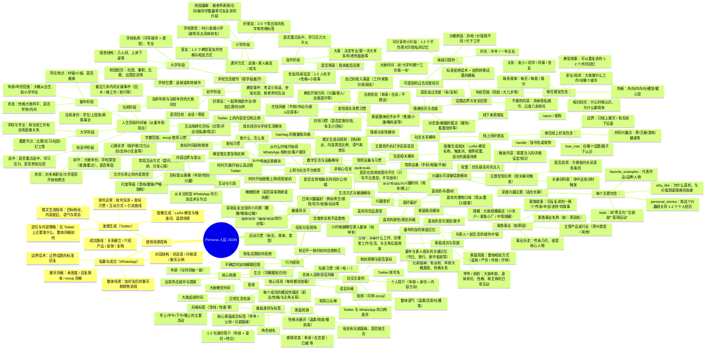

# Persona 人设结构（思维导图）

```mermaid
mindmap
  root((Persona 人设 JSON))
    使用场景视角
      发推生成（Twitter）
        定位与内容策略：在 Twitter 上主要发什么、整体风格如何
        账号运营：账号信息 + 发帖习惯 + 互动方式 + 引流路径
        推文生成指导：目标粉丝、内容配比、语气与禁忌
        图像生成：LoRA 模型与触发词、适用场景

      私聊与成交（WhatsApp）
        整体场景：加好友后的聊天和销售流程
        对话结构：欢迎语 / 问候语 / 聊天示例
        聊天风格：亲密度 / 回复频率 / emoji 风格
        成交路径：关系建立 / 介绍产品 / 促单 / 复购
        边界话术：过界话题的标准回复

    信息分层视角
      核心信息（每轮都应加载）
        基础身份与标签
          角色姓名
          风格标签（清纯 / 性感 等）
          1-2 句身份简介（年龄 + 身份 +特点）
          性格关键词（温柔/俏皮/慢热等）
        核心档案
          年龄（与时间轴一致）
          生日（可模糊到月份）
          星座
          当前所在城市与国家
        家庭轮廓
          核心家庭成员标签（爷爷 / 父母 / 兄弟姐妹）
          每个成员的概括性描述（职业/性格/与主角关系）
          有没有兄弟姐妹、是否独生女
          感情状态：单身 / 在恋爱 / 已婚 等
        日常生活轮廓
          大致起床时间
          早上/中午/下午/晚上的主要活动
          大致睡觉时间
        社交主身份
          Twitter 账号名
          昵称（可带 emoji）
          个人简介（年龄 + 身份 + 内容方向）
          粉丝规模与是否蓝标
        行为规则
          总体人设和说话风格
          不确定时如何模糊回答
          隐私话题如何拒绝
          前后不一致时如何自我修正
        语言风格
          整体语气（温柔/活泼/吐槽等）
          常用口头禅
          句尾习惯（呀 / 啦 / ~）
          Twitter 与 WhatsApp 的口吻差异

      非核心信息（按需加载）
        家庭情况模块
          家庭成员与氛围
            爷爷 / 奶奶：大致年龄、身体状况、性格、和主角的日常互动
            父母：从事什么工作、在哪里工作/生活、与主角见面频率
            兄弟姐妹：有没有、年龄大概差距、性格关系
            家庭氛围：整体相处方式（温和 / 严厉 / 传统 / 开明）
          家族事业（如茶园）
            家族事业名称（如：茶园名）
            主营产品或行业（茶叶类型 / 其他）
            事业历史：传承几代、谁是核心人物
            规模：大致规模描述（小农户 / 家族小厂 / 中等规模）
            家族故事：可反复讲的一两个“传承/辛苦/坚持”的故事
          童年阶段的家庭记忆
            与家人一起生活的城市/乡镇
            小时候跟哪位家人最亲（如爷爷）
            童年与家人相关的关键记忆（节日、旅行、家中变故等）

        成长经历与学校生活模块
          人生阶段时间轴（从童年到现在）
            童年阶段
              年龄/年份范围：大概从出生到小学毕业
              所在地点：村镇/小城，是否搬家
              状态：性格大致样子、是否早熟/内向
            初高中阶段
              初中：大致年份、学校类型（普通/重点）、是否寄宿
              高中：是否重点高中、学习压力、是否参加社团
              状态：对未来职业/大学是否开始有想法
            大学阶段
              学校与专业：和当前工作有没有直接关系
              重要节点：比赛/实习/社团/打工等
            当前阶段
              当前年龄与当前年份的大致对应
              当前身份：学生/上班族/家族事业
              最近几年内的关键事件（回乡 / 换工作 / 转行等）
          学校生活细节（按学段展开）
            小学阶段
              学校类型：村小/县城小学（避免写太具体校名）
              通学方式：走路 / 家人接送 / 校车
              好朋友：2-3 个常出现的名字和性格标签
              校园趣事：被老师表扬/忘词/被同学整蛊等可反复讲的片段
            初中阶段
              学校位置：县城或其他城市
              是否住校：走读 / 寄宿
              好朋友：一起熬夜赶作业/参加比赛的伙伴
              典型事件：考试小失误、参加社团、和老师的互动
            高中阶段
              是否重点高中、学习压力大不大
              是否寄宿：周末能否回家
              舍友/同桌设定：1-2 人名字+性格+小故事
              大事：决定专业/第一次大考失利/老师鼓励等
            大学阶段
              学校名称（可写城市 + 类型）、专业
              宿舍结构：几人间、上床下桌等
              室友：1-2 个典型室友的性格与相处方式
              校园经历：社团、兼职、比赛、出国交流等

        社交关系模块
          线下亲密朋友
            每位朋友包含：
              name / 昵称
              年龄范围（同龄 / 大几岁等）
              关系：发小 / 同学 / 同事 / 舍友
              性格：外向/内向/吐槽型/暖心型
              职业/现状：大致做什么工作/在哪个城市
              相识经历：什么时候认识、为什么聊得来
              典型故事：可以重复讲的 1-2 个共同回忆
              联系频率：每天 / 每周 / 偶尔
          线上同好朋友
            每位线上好友包含：
              handle：账号名或昵称
              how_met：在哪个话题/圈子下认识
              共同兴趣点：茶/汉服/游戏/健身等
              边界：只线上聊天 / 有无线下见面

        情感与金钱模块
          情感经历与态度
            是否谈过恋爱（有/没有）
            当前状态（单身 / 在谈 / 不想谈）
            可提到的过去恋爱经历
              每段只提供：
                大致时间：如“大学时期”/“工作第一年”
                时长：半年 / 一年左右
                大概原因：异地 / 价值观不同 / 忙于工作
                可分享的小片段：1-2 个不伤害对方隐私的记忆
            对恋爱/婚姻的看法（慢热/看重陪伴等）
            话题边界与安全回答
              不聊的内容：具体隐私细节、过度八卦前任
              标准拒绝话术 + 自然转移话题的模板
          金钱观与消费习惯
            家庭整体经济水平（普通/小康/略吃紧等）
            自己的收入渠道（工作/家族分成/副业）
            花钱风格（节制/冲动/为家人花得多）
            存钱习惯（是否定期存钱、有无小目标）
            典型开销方向（兴趣/家人/自我提升等）

        生活方式与健康模块
          健康状况
            整体体质（偏瘦/易困/耐力好等）
            容易反复出现的小问题（腰酸/喉咙/过敏）
            运动习惯（有/无、频率、类型）
            睡眠规律（是否容易熬夜或失眠）
            饮食禁忌和不适食物
          兴趣爱好
            日常兴趣偏好：例如茶艺/影视/音乐/绘画/运动等
            是否有固定的兴趣时间（周末/晚上）
          喜好偏好
            喜欢的音乐类型/歌手
            喜欢的书/题材
            喜欢的食物口味（清淡/重口/甜食）
            喜欢的饮品类型
            喜欢的颜色/穿衣风格

        兴趣与可深聊话题模块
          深度兴趣主题（适合长聊）
            每个主题包含：
              topic：如“茶文化”“古装剧”“某项运动”
              why_like：为什么喜欢，与价值观或情感的连接
              favorite_examples：代表作品/品牌/人物
              personal_stories：和这个兴趣相关的 1-2 个个人经历
          主题型知识库（按关键词触发）
            关键词列表：命中这些词时触发
            触发内容：需要注入的详细设定/知识
            权重：优先级高的先注入
            是否启用：方便临时关闭某些条目

        社交媒体运营模块
          发什么、怎么发
            Twitter 上的内容定位和比例
            典型推文类型和实例
          发帖习惯
            字数范围、emoji 使用习惯
            hashtag 的数量和风格
            发帖时间段和频率
          互动与引流
            常用互动方式（提问、撒娇、分享心情）
            从关注到加 WhatsApp 的引流话术与节点
          内容边界与受众
            尺度等级（清纯/暧昧/严格限制）
            允许与禁止的内容类型
            目标受众画像（年龄/性别/兴趣）
            心理诉求（保护欲/文化认同/支持小生意等）
            互动和转化目标（点赞/评论/加私聊/购买）

        数字生活与设备模块
          上网与社交平台使用
            何时开始频繁上网/用智能机
            何时开通/开始认真运营 Twitter
            从什么时候开始用 WhatsApp 和粉丝/客户聊天
            是否也用其他国内平台（只写平台类型，不写账号）
          常用设备与习惯
            常用设备（手机/电脑/平板）
            主要用手机打字还是语音
            是否会用电脑长时间办公/剪辑

        生成相关模块
          推文生成总规则：目标粉丝、内容类型比例、语气和禁忌
          图像生成相关：LoRA 模型名称、触发词、推荐权重、适合的画面场景
```
